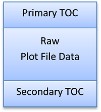
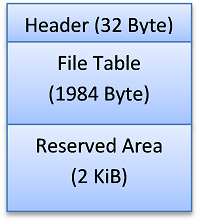

    CIP: 12
    Layer: Applications
    Title: BFS
    Author: Brmmm / JohnnyFFM
    Comments-Summary: No comments yet.
    Comments-URI: https://github.com/PoC-Consortium/CIPs/wiki/Comments:CIP-0012
    Status: Draft
    Type: Process
    Created: 2018-07-25

## Abstract

Burstcoin File System ("BFS") is a file system optimized for
Burstcoin. It features a light-weight table of contents ("TOC") for
minimal overhead, a smart data fragmentation ("SDF") ensuring that
reading a scoop in a mining round is just a single seek and a big
sequential read, sector alignment and 4KiB addressing for optimal
performance on current hard drives as well as a bad sector handling
mechanism. BFS is operating system independent and can be embedded as
a partition in any GPT formatted media.

## Motivation

Current file systems are not designed for Burstcoin and have several
disadvantages when storing plotfiles, in particular: file system
overhead (mostly unused space that could be used to store nonces),
fragmentation (when adding / deleting plot files of different sizes),
operating system dependency and inefficient sector alignment (512e
vs. native 4k sector alignment).

## Specification

### BFS Scheme

A BFS partition comprises three elements: A primary table of contents
(“TOC”) at the very beginning of the partition, the raw plot file data
and a secondary table of contents at the very end of the partition as
backup. To ensure TOC integrity, CRC32 is used. If the primary TOC is
corrupted (e.g. due to a bad sector), the secondary TOC can be
used. The physical distance between primary and secondary TOC is
maximized to minimize failure correlation.

__BFS Partition Scheme__

### BFS Table of Contents

The table of contents comprises three elements, a header, a file table
and a reserved area for future extensions. For drives with a physical
sector size of 4KiB or any factor of 4KiB the standard size of the BFS
TOC cluster is 4 KiB. The header size is 32 byte and the standard file
table size is 1984 byte (for up to 72 plot file segments). The
reserved area is 2 KiB in size.

__BFS Table of Contents Scheme__

#### BFS Header

The header is structured as follows:

| Field Name                   | Content | Size   | Comment                                                    |
| ---------------------------- | ------- | ------ | ---------------------------------------------------------- |
| Version                      | "BFS1"  | 4 byte | version information                                        |
| CRC32                        | CRC32   | 4 byte | CRC32 of the complete TOC with this field set to zero      |
| Disk size                    | UInt64  | 8 byte | Size of disk in 4k sectors                                 |
| Numerical ID                 | UInt64  | 8 byte | Numerical ID for all files on the disk                     |
| Number of plot file segments | UInt32  | 4 byte | Number of plot file segments in file table (standard = 72) |
| Reserved                     | Empty   | 4 byte | -                                                          |

A standard TOC can hold up to 72 plot file segments. However, if more
segments are needed, the TOC can be extended by adding further 4KiB
sectors and increasing the number of files. To preserve the 4k
alignment, another empty area between File Table and Reserved Area
needs to be created.

#### BFS File Table

A BFS file table contains 72 or more slots for plot file segments. A
plot file segment is defined as a series of consecutive nonces.  Each
slot (28 byte) contains:

| Contents   | Type   | Size   | Comment                                             |
| ---------- | ------ | ------ | --------------------------------------------------- |
| StartNonce | UInt64 | 8 byte | Starting nonce of the segment                       |
| Nonces     | UInt32 | 4 byte | Number of nonces in the segment                     |
| StartPos   | UInt64 | 8 byte | 4k sector number where the plot file segment starts |
| Status     | UInt32 | 4 byte | plot file segment status, see below                 |
| Pos        | UInt32 | 4 byte | counter used for writing and plotting               |

Plot file segment status:

| Status | Description | Comment                                                                                                                                                       |
| ------ | ----------- | ------------------------------------------------------------------------------------------------------------------------------------------------------------- |
| 0      | EMPTY       | Slot is empty                                                                                                                                                 |
| 1      | OK          | File is ready to use                                                                                                                                          |
| 2      | WRITING     | File is incomplete. Current position is saved in parameter 'Pos'.                                                                                             |
| 3      | PLOTTING    | File is incomplete. Current nonce is saved in parameter 'Pos'.                                                                                                |
| 4      | CONVERTING  | File is incomplete. Current scoop is saved in parameter 'Pos'.                                                                                                |
| 9      | BAD         | File segments contain bad sectors, Pos is split in 2x16bit (UInt16) representing start and end scoops of the damaged area that should be skipped when mining. |

NB: Plot data on BFS is supposed to be PoC2, PoC1 is not supported.

### Plot File Data and Fragmentation

#### 64 Nonces Constraint

To achieve optimal sector alignment, a 4 KiB cluster size based BFS
only supports plot file segments containing multiples of 64
nonces. Adhering to this constraint simplifies direct I/O drive
access.

Background: In a mining round, 64 byte of each nonce (=one scoop) is
being read. To optimize I/O load during mining, those 64 byte of each
nonce are stored in sequence (concept of optimized plot files). As the
smallest segment that can be read on modern drives without overhead is
4KiB, it makes sense to store only multiples of 64 nonces (64 nonces x
64 byte = 4KiB). It also ensures that each plot file segment starts at
the beginning of a physical sector simplifying addressing.

The downside of this constraint is overhead: The space of up to 63 nonces (~16MB) might remain unused.

#### Fragmentation

To store nonces, BFS uses a concept called optimized container. An
optimized container is like a single big optimized plot file taking up
the full plot file data area with an additional relaxation: Not all
nonces need to be stored in consecutive order. The container can be
divided into plot file segments and nonces only need to be in
consecutive order within each plot file segment. Each plot file
segment (FS) is referenced by an entry in the file table.

__Data Fragmentation__

The concept ensures that reading a scoop in a mining round is just a
single seek and a big sequential read for optimal performance.

### Bad Sector Handling

Bad sectors can be handled via the TOC. If a hard disk has a faulty
area, all that needs to be done is to isolate the area in a plot file
segment by splitting entries in the BFS file table and assign the
status “bad”.

### Creating a BFS partition inside a GPT

A BFS Partition can easily be embedded in a GPT structure. It is
advised to create a proper partition for BFS to avoid confusing the
operating system and prevent it from interfering. A GPT partition
entry consists of:

| Field                       | Content | Comment                                |
| --------------------------- | ------- | -------------------------------------- |
| Partition type GUID for BFS | GUID    | {53525542-4354-494F-4E46-494C45535953} |
| Unique partition GUID       | GUID    | random GUID                            |
| First LBA                   | 8 byte  | little endian                          |
| Last LBA                    | 8 byte  | inclusive, usually odd                 |
| Attribute flags             | 8 byte  | GPT partition attributes               |
| Partition name              | 72 byte | 36 UTF-16LE code units                 |

The GPT is usually stored in the first 5 and last 5 4KiB sectors of a hard drive, resulting in an overhead of 40 KiB.

### Implementation
#### Implementing BFS

There are two ways of implementing the BFS. Either the file system is
implemented as a stack or one allows for fragmentation. However, since
the number of file segments is limited, a stack should be preferred.

Just some notes on file operations:

Merging adjacent plot file segments and splitting a plot file segment
into several segments are just operations on the BFS TOC and can
easily be implemented.

#### Implementing Plotting

The steps required for plotting would be:
1. Format a drive to BFS and set the Numeric ID
2. Create entries of plot file segments in the BFS TOC with status 3.
3. Start a BFS compatible plotter with just the physical drive identifier as parameter
The Plotter can read the BFS TOC, and can start to plot incomplete files. It can store the plotting progress in the TOC to allow resuming.

#### Implementing Mining

The steps required for mining would be:
1. Read the BFS TOC and extract file segment information
2. Use direct I/O to access the drive using the extracted information (might require admin rights depending on OS)
The Miner can use finished plot file segments as well as files with status 3 ("plotting in progress").

### Limitations / Extensions
#### PoC3 compatibility

It’s not clear yet how to support PoC3 files with BFS. Most likely there will need to be an additonal parameter referencing the underlying data.  

#### Support for 520b and alike

The BFS concept can be applied to drives with a sector size of 520b &
528b. All that needs to be done is to use a cluster size of 4160 byte
for 520b and 4224 byte for 528b. The nonces constraint would then be
65 nonces for 520b and 66 nonces for 528b.

#### Performance

There is a downside to the optimized container approach: As
performance is not homogenous for hard disks with spinning platters,
transfer speeds depend on the physical location of data. The outer
area of a hard disk platter performs better than the inner area. This
affects scan time, scoop 0 is scanned at fastest speed, scoop 4095 at
slowest speed. This might make it complicated to balance a large
mining setup. A possible solution will be presented in a separate CIP.

## Copyright

This document is placed in the public domain.
